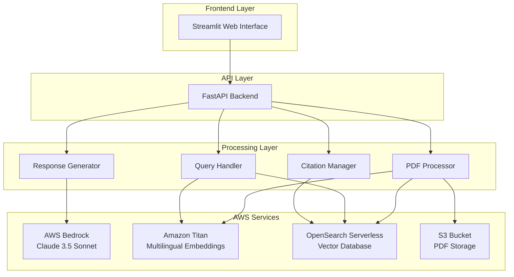
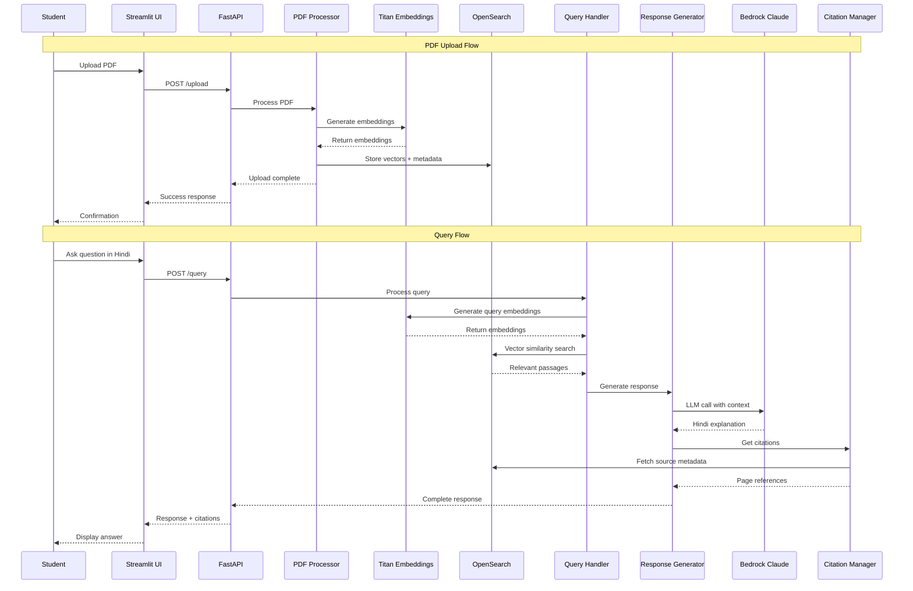

# Design Document: Setu-AI

## Overview

Setu-AI is a multilingual RAG (Retrieval-Augmented Generation) system that bridges the language gap in computer science education for Indian students. The system processes English PDF textbooks, enables Hindi queries, and generates culturally relevant explanations using AWS cloud services.

The architecture follows a microservices pattern with clear separation between document processing, retrieval, and generation components. The system leverages AWS Bedrock for LLM capabilities, Amazon Titan for multilingual embeddings, and OpenSearch Serverless for vector storage.

## Architecture

### High-Level Architecture



### Data Flow Architecture



## Components and Interfaces

### 1. PDF Processor Component

**Responsibilities:**
- Extract text from uploaded PDFs while preserving page structure
- Generate multilingual embeddings for text chunks
- Store vectors and metadata in OpenSearch
- Handle PDF validation and error cases

**Interfaces:**
```python
class PDFProcessor:
    def validate_pdf(self, file: UploadFile) -> ValidationResult
    def extract_text_with_pages(self, pdf_path: str) -> List[TextChunk]
    def generate_embeddings(self, chunks: List[TextChunk]) -> List[Embedding]
    def store_in_vector_db(self, embeddings: List[Embedding]) -> str
```

**Key Design Decisions:**
- Chunk size: 512 tokens with 50-token overlap for context preservation
- Page tracking: Each chunk maintains original page number and position
- Error handling: Graceful degradation for corrupted or image-heavy PDFs

### 2. Query Handler Component

**Responsibilities:**
- Process Hindi queries and generate embeddings
- Perform semantic search in OpenSearch
- Rank and filter results by relevance
- Handle query preprocessing and normalization

**Interfaces:**
```python
class QueryHandler:
    def preprocess_query(self, query: str) -> str
    def generate_query_embedding(self, query: str) -> Embedding
    def semantic_search(self, embedding: Embedding) -> List[SearchResult]
    def rank_results(self, results: List[SearchResult]) -> List[RankedResult]
```

**Key Design Decisions:**
- Minimum similarity threshold: 0.7 for relevance filtering
- Result limit: Top 3 passages to avoid context overflow
- Query expansion: Support for common CS terminology variations

### 3. Response Generator Component

**Responsibilities:**
- Generate Hindi explanations using AWS Bedrock
- Incorporate real-world analogies relevant to Indian context
- Maintain technical accuracy while simplifying language
- Format responses for optimal readability

**Interfaces:**
```python
class ResponseGenerator:
    def generate_explanation(self, context: List[str], query: str) -> str
    def add_analogies(self, explanation: str, concept: str) -> str
    def format_response(self, text: str) -> FormattedResponse
    def validate_accuracy(self, response: str, source: str) -> bool
```

**Key Design Decisions:**
- Prompt engineering: Structured prompts for consistent Hindi output
- Analogy database: Curated set of Indian cultural references
- Response length: 200-400 words for optimal comprehension

### 4. Citation Manager Component

**Responsibilities:**
- Track source attribution for generated content
- Provide page references and original text excerpts
- Enable navigation back to source documents
- Maintain accuracy of citation mapping

**Interfaces:**
```python
class CitationManager:
    def extract_citations(self, results: List[SearchResult]) -> List[Citation]
    def format_citations(self, citations: List[Citation]) -> str
    def get_source_excerpt(self, page: int, position: int) -> str
    def validate_citations(self, citations: List[Citation]) -> bool
```

## Data Models

### Core Data Structures

```python
@dataclass
class TextChunk:
    content: str
    page_number: int
    position: int
    document_id: str
    embedding: Optional[List[float]] = None

@dataclass
class SearchResult:
    chunk: TextChunk
    similarity_score: float
    relevance_rank: int

@dataclass
class Citation:
    page_number: int
    excerpt: str
    document_title: str
    confidence_score: float

@dataclass
class Response:
    explanation: str
    citations: List[Citation]
    confidence_level: str
    processing_time: float
```

### OpenSearch Document Schema

```json
{
  "mappings": {
    "properties": {
      "content": {"type": "text", "analyzer": "multilingual"},
      "embedding": {"type": "dense_vector", "dims": 1536},
      "page_number": {"type": "integer"},
      "position": {"type": "integer"},
      "document_id": {"type": "keyword"},
      "document_title": {"type": "text"},
      "chunk_id": {"type": "keyword"},
      "created_at": {"type": "date"},
      "language": {"type": "keyword"}
    }
  }
}
```

### AWS Bedrock Integration

**Model Configuration:**
- Primary Model: Claude 3.5 Sonnet for response generation
- Temperature: 0.3 for consistent educational content
- Max tokens: 1000 for comprehensive explanations
- System prompt: Specialized for educational Hindi responses

**Prompt Template:**
```
You are an expert computer science tutor for Indian students. 
Given the following English text from a textbook and a student's question in Hindi, 
provide a clear explanation in Hindi using simple analogies relevant to Indian culture.

Context: {retrieved_text}
Question: {hindi_query}

Requirements:
1. Explain in simple Hindi
2. Use real-world analogies familiar to Indian students
3. Maintain technical accuracy
4. Keep explanation between 200-400 words
5. Include key English terms in parentheses when needed
```

## Error Handling

### Error Categories and Responses

1. **PDF Processing Errors**
   - Invalid format: Clear message with supported formats
   - Corrupted file: Suggest re-upload with file validation
   - Size limit exceeded: Inform about 50MB limit
   - Text extraction failure: Offer manual text input option

2. **Query Processing Errors**
   - Empty query: Prompt for valid question
   - Unsupported language: Guide to Hindi input methods
   - No relevant content: Suggest alternative queries
   - Embedding generation failure: Retry with simplified query

3. **LLM Service Errors**
   - Rate limiting: Queue request with estimated wait time
   - Service unavailable: Fallback to cached responses
   - Context too large: Automatic context truncation
   - Generation timeout: Partial response with retry option

4. **Vector Database Errors**
   - Connection failure: Retry with exponential backoff
   - Index corruption: Rebuild index notification
   - Search timeout: Return cached or approximate results
   - Storage limit: Archive old documents notification

### Graceful Degradation Strategy

```python
class ErrorHandler:
    def handle_pdf_error(self, error: PDFError) -> ErrorResponse
    def handle_search_error(self, error: SearchError) -> FallbackResponse
    def handle_llm_error(self, error: LLMError) -> CachedResponse
    def log_error_for_monitoring(self, error: Exception) -> None
```

## Testing Strategy

*We employ a dual testing strategy: Unit Testing for individual components (PDF Processor) and Property-Based Testing (using Hypothesis) to ensure system reliability across unpredictable inputs.*

The following correctness properties have been defined to ensure system reliability and full coverage of the requirements:

### Correctness Properties

Based on the prework analysis and property reflection, here are the key correctness properties that validate the system's behavior:

**Property 1: PDF Processing Workflow Integrity**
*For any* valid PDF file, the complete processing workflow (validation → text extraction → embedding generation → storage) should preserve all content with accurate page references and complete successfully.
**Validates: Requirements 1.1, 1.2, 1.3, 1.4, 1.6**

**Property 2: Input Validation Consistency**  
*For any* file input, the validation process should correctly accept valid PDFs and reject invalid files with appropriate error messages.
**Validates: Requirements 1.1, 1.5**

**Property 3: Query Processing Pipeline**
*For any* Hindi query, the processing pipeline (embedding generation → vector search → result ranking) should execute completely and return ranked results when relevant content exists.
**Validates: Requirements 2.1, 2.2, 2.3, 2.4, 2.6**

**Property 4: Multilingual Response Generation**
*For any* retrieved English content and Hindi query, the response generator should produce Hindi explanations that are properly formatted and include the original technical terms when needed.
**Validates: Requirements 3.1, 3.2, 3.6, 9.6**

**Property 5: Complete Citation Mapping**
*For any* generated response, all citations should accurately map to source locations, include page references, and provide original text excerpts.
**Validates: Requirements 4.1, 4.2, 4.3, 4.4, 4.5**

**Property 6: UI Interaction Completeness**
*For any* user interaction (file upload, query submission, citation clicks), the system should provide appropriate feedback, maintain session state, and support Hindi input/display.
**Validates: Requirements 5.2, 5.3, 5.4, 5.5, 5.6, 4.6**

**Property 7: Performance Under Load**
*For any* system load up to 100 concurrent users, response times should remain within specified limits (10 seconds for queries, sub-second for search, 5 minutes for large PDFs).
**Validates: Requirements 6.1, 6.2, 6.3, 6.5, 6.6**

**Property 8: Data Security and Privacy**
*For any* user data (PDFs, queries, responses), the system should apply encryption, access controls, and proper data deletion while avoiding logging of sensitive content.
**Validates: Requirements 7.1, 7.2, 7.3, 7.4, 7.6**

**Property 9: Error Recovery and Resilience**
*For any* system failure or service unavailability, the system should handle errors gracefully, provide appropriate messages, attempt fallbacks, and preserve user state.
**Validates: Requirements 8.1, 8.2, 8.3, 8.4, 8.5, 8.6**

**Property 10: Response Quality Indicators**
*For any* generated explanation, the system should include confidence levels and ask clarifying questions when content is ambiguous rather than providing uncertain answers.
**Validates: Requirements 9.4, 9.5**

**Property 11: System Monitoring and Analytics**
*For any* system usage, metrics should be logged without personal information, alerts should be generated for performance issues, and daily reports should be produced with accurate statistics.
**Validates: Requirements 10.1, 10.2, 10.3, 10.4, 10.5, 10.6**

### Testing Strategy

**Dual Testing Approach:**
The system requires both unit testing and property-based testing for comprehensive coverage:

- **Unit tests**: Focus on specific examples, edge cases (like empty search results), and integration points between components
- **Property tests**: Verify universal properties across all inputs using randomized test data

**Property-Based Testing Configuration:**
- **Framework**: Use Hypothesis for Python property-based testing
- **Iterations**: Minimum 100 iterations per property test to ensure thorough coverage
- **Test Data Generation**: 
  - Random PDF content with varying sizes and structures
  - Random Hindi queries with different complexity levels
  - Random system load scenarios for performance testing
- **Tagging**: Each property test tagged with format: **Feature: setu-ai, Property {number}: {property_text}**

**Unit Testing Focus Areas:**
- AWS service integration points (Bedrock, Titan, OpenSearch)
- Error handling for specific failure scenarios
- Edge cases like empty PDFs, unsupported languages, network timeouts
- UI component behavior and user interaction flows
- Data model validation and serialization

**Integration Testing:**
- End-to-end workflows from PDF upload to response generation
- Cross-component communication and data flow
- AWS service availability and failover scenarios
- Performance testing under realistic load conditions

**Test Environment Setup:**
- Mock AWS services for unit tests to avoid external dependencies
- Staging environment with real AWS services for integration tests
- Load testing environment for performance validation
- Automated test execution in CI/CD pipeline

**Coverage Requirements:**
- Minimum 90% code coverage for core components
- All correctness properties must have corresponding property tests
- All error handling paths must have unit test coverage
- Performance benchmarks must be validated in staging environment

The testing strategy ensures that both individual components work correctly (unit tests) and that the system maintains its correctness properties across all possible inputs (property tests), providing confidence in the system's reliability for educational use.